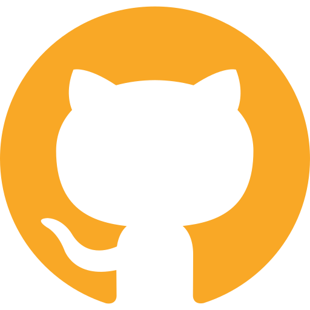

# Hackatanga - Frontend

Olá, bem vindos ao nosso projeto "Hackatanga".

A **_Hackatanga_** é uma plataforma para pessoas em nível júnior que sentem dificuldade em entrar no mercado de trabalho, pois não tem experiência na área ou não conhecem quem os indique para as vagas.

A **_Hackatanga_** permite que pessoas que se conectem para realizar diversos desafios propostos por nossos parceiros e ao final possam receber feedback dos mesmos. Além de incentivar o networking, a plataforma **_Hackatanga_** também ajuda no desenvolvimento de softskills já que os desafios em sua maioria são desenvolvidos em grupo, também no desenvolvimento de projetos para o portfolio do usuário, no desenvolvimento de experiência na área, e também a possibilidade de visibilidade pelas empresas parceiras e outras!

# Tecnologias utilizadas

O "Hackatanga" foi criado utilizando a stack MERN com Styled Components!

# O Front-end

Para ver o repositório do nosso backend:

(Back-end)[https://github.com/tassiaaccioly/provihack-back]

# Quem criou o projeto?

Ficou interessado(a)? Entre em contato conosco!

Essas são as mulheres maravilhosas por trás desse projeto:

**Tassia Accioly - Back-end e Front-end**

[][linkedin-tassia]
[][github-tassia]

  

**Mariana Maiko - Front-end**

[][linkedin-mari]
[][github-mari]

  

**Juliana Felippe - UX/UI Designer**

[][linkedin-ju]

  

**Laura Santos - Product Owner**

[][linkedin-laura]

  

**Renata Piauí - Data**

[][linkedin-re]

    

_Esse projeto foi desenvolvido em 48h e faz parte do Hackaton **Provi Hack Woman** realizado pela **Provi** e diversos parceiros do dia 04/02/2021 ao dia 12/02/2021_

[linkedin-tassia]: https://www.linkedin.com/in/tassiaaccioly
[github-tassia]: https://github/com/tassiaaccioly
[linkedin-mari]: https://www.linkedin.com/in/mariana-maiko-tsukasaki-717336bb/
[github-mari]: https://github.com/Marimaiko
[linkedin-ju]: https://www.linkedin.com/in/
[linkedin-laura]: https://www.linkedin.com/in/
[linkedin-re]: https://www.linkedin.com/in/renata-borges-a11881110
